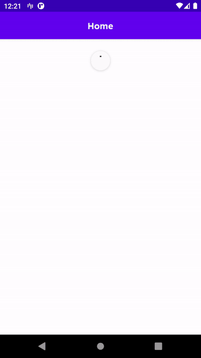
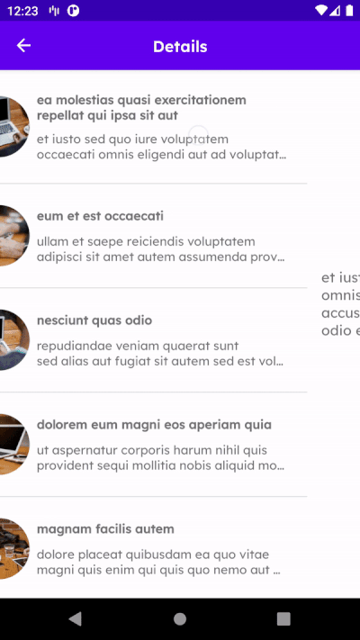

|                          Home                           |                         Details                     |
| :----------------------------------------------------:  | :-------------------------------------------------: |
| | | 

## Features

* Kotlin Coroutines with Flow
* MVVM
* Android Architecture Components
* Multi-module architecture
* Dagger Hilt
* Kotlin Gradle DSL

## Libraries

* [Retrofit](https://square.github.io/retrofit/)

* [Lifecycle](https://developer.android.com/jetpack/androidx/releases/lifecycle)

* [Dagger Hilt](https://dagger.dev/hilt/)

* [Coroutines](https://github.com/Kotlin/kotlinx.coroutines)

* [Room](https://developer.android.com/training/data-storage/room)

* [Navigation Component](https://developer.android.com/guide/navigation/navigation-getting-started)

* [Moshi](https://github.com/square/moshi)

* [okhttp-logging-interceptor](https://github.com/square/okhttp/blob/master/okhttp-logging-interceptor/README.md)

* [Glide](https://github.com/bumptech/glide)

* [MockWebServer](https://github.com/square/okhttp/tree/master/mockwebserver)

* [Truth](https://truth.dev/)

## Project Structure

* :app - application module that depends on all other modules. This module contains MainActivity and
  CustomApplication class.
* :common - contains some common components like resources, views, base classes.
* :core - contains di modules, api-related components, repository classes and db components.
* :remote - contains api factory and base mapper class for remote models.
* :home - contains components related to the home screen, details screen and edit dialog of the app.

